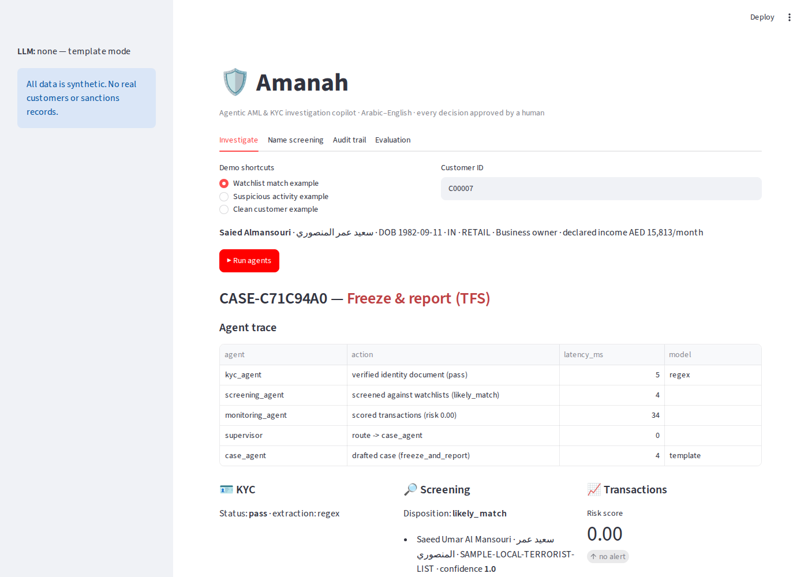
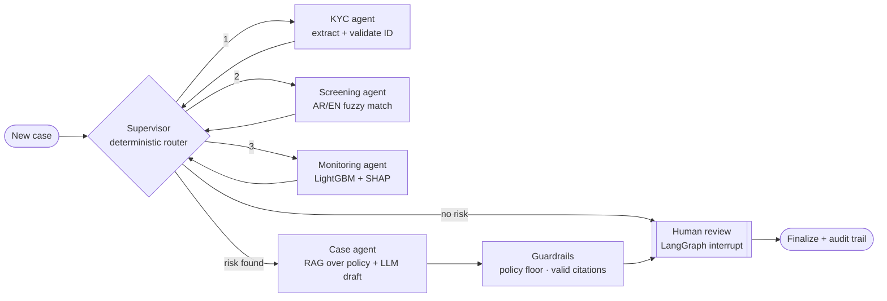

# 🛡️ Amanah — Agentic AML & KYC Investigation Copilot (Arabic–English)

[](https://github.com/Ayshalubna/amanah/actions/workflows/ci.yml)


**Amanah** (أمانة, "trust") is a multi-agent system that helps bank compliance teams onboard customers and investigate suspicious activity. It checks identity documents, screens names against sanctions lists in both Arabic and English, scores transaction risk, and drafts a cited case report. **The investigator approves every decision.**

Built with LangGraph, LightGBM, SHAP, FastAPI and Streamlit. It runs **completely free**: locally with Ollama, on a free API tier, or with no LLM at all.



---

## Why this problem

Banks in the UAE must verify customers, screen them against the UN Security Council Consolidated List and the UAE Local Terrorist List, and report suspicious transactions to the Financial Intelligence Unit through goAML. Three things make this hard:

1. **Names cross scripts.** `محمد عبد الله`, `Mohammed Abdullah` and `Muhammad Abd Allah` can be the same person. Plain fuzzy matching misses many of these.
2. **Alerts drown investigators.** Rule-based monitoring either misses new patterns or raises too many false alarms.
3. **AI must stay accountable.** A model cannot freeze funds or close an alert on its own. Every step has to be explainable and auditable.

## Architecture



| Agent | What it does | How |
|---|---|---|
| **Supervisor** | Decides which agent runs next, and whether the LLM is needed at all | Deterministic policy routing, so the model never decides the workflow |
| **KYC agent** | Reads Arabic/English ID-card text, extracts fields and validates them | LLM extraction with regex fallback · Emirates ID format + Luhn check digit · expiry · AR↔EN name agreement · application mismatch |
| **Screening agent** | Screens names against sanctions/PEP lists | Arabic normalisation + transliteration · spelling-family canonicalisation · vowel-insensitive phonetic keys · RapidFuzz · date-of-birth and nationality corroboration |
| **Monitoring agent** | Scores transaction risk and explains it | 15 behavioural features · LightGBM · SHAP drivers · named typology indicators (structuring, rapid movement, high-risk corridors, income mismatch, dormant spikes) |
| **Case agent** | Drafts the investigator's case summary | Bilingual retrieval over AML policy → LLM draft in JSON with citations |
| **Human review** | Investigator approves, rejects or escalates | `interrupt()` pauses the graph; nothing closes without a person |

### Guardrails
- **Policy floor:** the rule-based floor sets the minimum recommendation, for example `freeze_and_report` on a likely sanctions match. The LLM may raise it but never lower it.
- **Citation check:** citations that were not in the retrieved policy passages are removed.
- **No autonomous actions:** agents propose; the investigator decides. Every step is written to an append-only SQLite audit trail with timestamp, latency and model.
- **Cost control:** the LLM case agent runs only when risk is found. About half of cases skip it.

## Results

Reproduce with `python -m eval.run_eval`. CI fails the build if these drop below set floors. **All data is synthetic.**

### Name screening: 1,180 labelled queries (480 true variants, 700 hard negatives)

| Matcher | Precision | Recall | F1 |
|---|---|---|---|
| **Amanah** (bilingual matching + DOB/nationality) | **0.992** | **0.994** | **0.993** |
| Amanah, name only | 0.709 | 0.981 | 0.823 |
| Plain fuzzy matching | 0.871 | 0.675 | 0.761 |
| Exact match | 1.000 | 0.235 | 0.381 |

Plain fuzzy matching finds **0%** of mixed Arabic/English names, 40% of names with Arabic diacritics and 40% with honorifics. Amanah finds 100% of each.

### Transaction monitoring: 3,000 customers, 5-fold cross-validation

| Approach | Recall | Precision | Alerts |
|---|---|---|---|
| **LightGBM risk model** | **0.90** | **0.51** | 422 |
| Rules-only baseline | 0.70 | 0.44 | 373 |

ROC-AUC 0.972 · PR-AUC 0.824. For about the same alert volume, the model catches **29% more** suspicious customers than rules alone. The data includes realistic look-alikes (property sales, bonuses, cash businesses, family remittances), so this is not a trivial task.

### End to end: 400 customers through the full graph (held-out risk model)

- Watchlist customers flagged: **100%**
- Suspicious customers escalated: **91%**
- Clean customers cleared: **82%** (false alert rate 12%)
- Median latency **22 ms** per case without the LLM
- Every case required an investigator decision

Full report: [`eval/RESULTS.md`](eval/RESULTS.md)

## Quick start

```bash
git clone https://github.com/Ayshalubna/amanah.git
cd amanah
python -m venv .venv
# Windows: .venv\Scripts\activate    macOS/Linux: source .venv/bin/activate
pip install -r requirements-dev.txt

python -m scripts.train_model        # generates synthetic data + trains the risk model
pytest -q                            # 18 tests
streamlit run app/dashboard.py       # investigator dashboard  -> http://localhost:8501
uvicorn amanah.api:api --reload      # REST API + docs        -> http://localhost:8000/docs
```

### Choose an LLM (all free)

| Option | Setup |
|---|---|
| **Ollama (default, local, private)** | Install [Ollama](https://ollama.com), then `ollama pull qwen2.5:7b` (strong in Arabic) |
| **Groq free tier** | Set `AMANAH_LLM=openai` and `OPENAI_API_KEY=<free key>` |
| **No LLM** | `AMANAH_LLM=none`: deterministic templates, used in CI |

Optional hybrid retrieval: `pip install -r requirements-embeddings.txt` adds multilingual embeddings (`intfloat/multilingual-e5-small`) on top of TF-IDF.

### Docker

```bash
docker compose up --build
docker compose exec ollama ollama pull qwen2.5:7b
```

### Use the real UN sanctions list

```bash
python -m scripts.load_un_list
set AMANAH_WATCHLIST=amanah/data/un_consolidated.json      # Windows (export on macOS/Linux)
```

## API

| Method | Endpoint | Purpose |
|---|---|---|
| `POST` | `/cases` | Run all agents for a customer; returns the case awaiting review |
| `POST` | `/cases/{id}/review` | Investigator decision: `approve`, `reject` or `escalate` |
| `GET` | `/cases?status=awaiting_review` | Review queue |
| `GET` | `/cases/{id}/audit` | Full audit trail |
| `POST` | `/screen` | Screen a single name (Arabic/English) |
| `GET` | `/policy/search?q=` | Bilingual policy retrieval with citations |

## Project structure

```
amanah/
  graph.py        LangGraph supervisor, agents, guardrails, human-in-the-loop
  names.py        Arabic normalisation, transliteration, phonetic keys
  screening.py    sanctions / PEP screening with corroboration
  kyc.py          document extraction + Emirates ID validation
  monitoring.py   features, LightGBM, SHAP, typology indicators
  rag.py          bilingual policy retrieval (TF-IDF / hybrid)
  llm.py          Ollama / OpenAI-compatible / none
  audit.py        SQLite case store + audit trail
  api.py          FastAPI
  synth.py        deterministic synthetic data generator
  data/policies/  sample AML procedures (English + Arabic)
app/dashboard.py  Streamlit investigator UI
eval/run_eval.py  evaluation harness + CI regression gate
tests/            unit, integration and guardrail tests
```

## Limitations and next steps
- The data is synthetic. Real deployment needs bank data, model validation and regulator engagement.
- KYC reads OCR text; plugging in an OCR engine (e.g. Azure Document Intelligence or Tesseract with Arabic) is the next step.
- The sample policy is illustrative and is not legal guidance.
- Planned: network (graph) features for linked accounts, drift monitoring, goAML-format STR export.

## License
MIT
